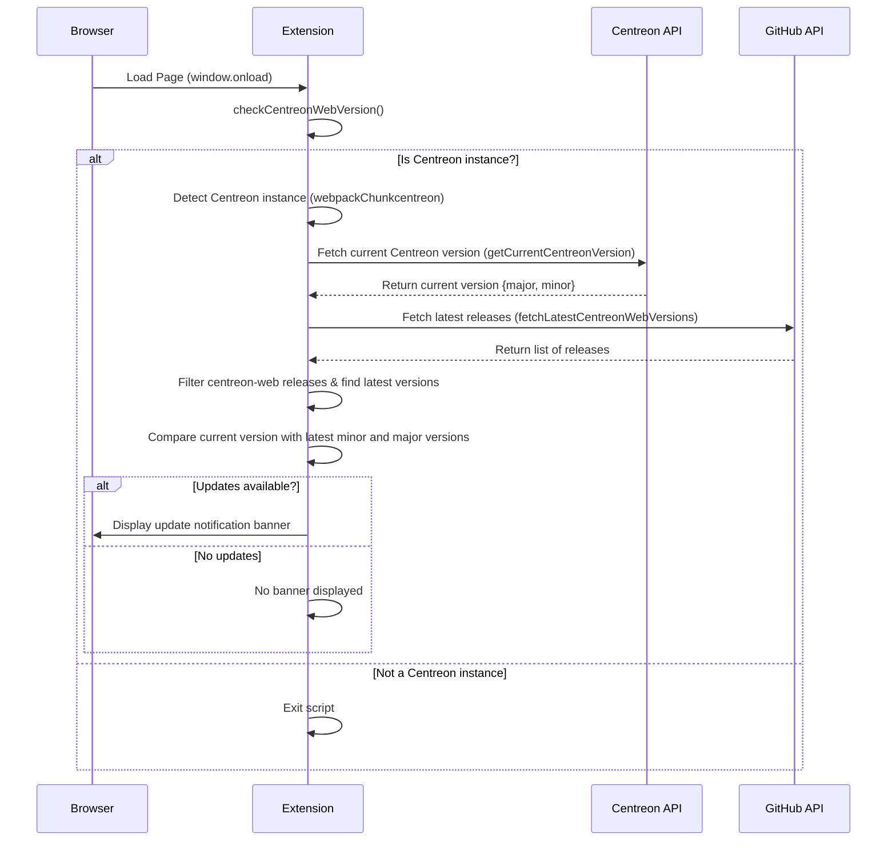

```mermaid
sequenceDiagram
    participant Browser
    participant Script as Extension
    participant CentreonAPI as Centreon API
    participant GitHubAPI as GitHub API
    
    Browser->>Script: Load Page (window.onload)
    Script->>Script: checkCentreonWebVersion()
    
    alt Is Centreon instance?
        Script->>Script: Detect Centreon instance (webpackChunkcentreon)
        Script->>CentreonAPI: Fetch current Centreon version (getCurrentCentreonVersion)
        CentreonAPI-->>Script: Return current version {major, minor}
        
        Script->>GitHubAPI: Fetch latest releases (fetchLatestCentreonWebVersions)
        GitHubAPI-->>Script: Return list of releases
        
        Script->>Script: Filter centreon-web releases & find latest versions
        
        Script->>Script: Compare current version with latest minor and major versions
        
        alt Updates available?
            Script->>Browser: Display update notification banner
        else No updates
            Script->>Script: No banner displayed
        end
    else Not a Centreon instance
        Script->>Script: Exit script
    end
```
